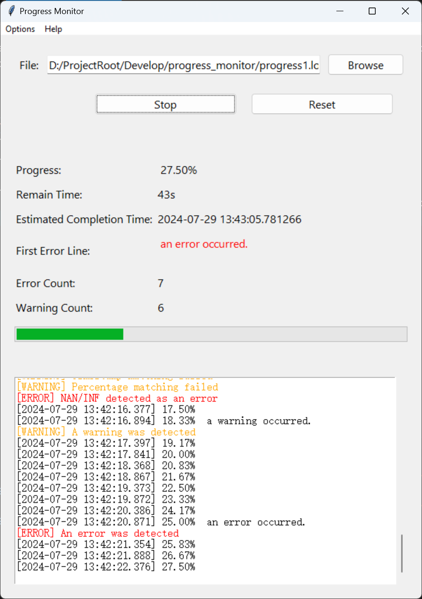
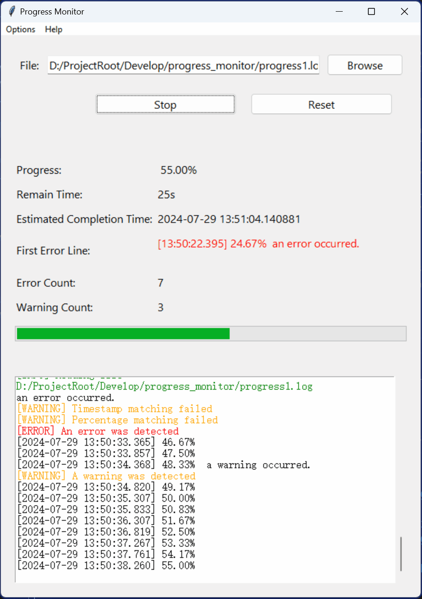

# README

This is a Python Tkinter-based GUI tool script for monitoring progress information in log files, providing corresponding statistics and display functions.

## Progress Monitoring for Scientific Computing Programs

We often care about the running progress of a scientific computing program.
However, it is usually inappropriate to require the program itself to provide visual progress information:

- Scientific computing programs written in some programming languages cannot directly provide a graphical interface for the progress bar, such as programs written in C/C++/Fortran, which can only output characters to the console.
- If a progress bar is directly implemented in the console, the output of other necessary information will frequently disrupt the display of the progress bar. In addition, there are issues with encoding and terminal size changes in the terminal, which will affect the display of the progress bar.

We can take an indirect approach: the scientific computing program only needs to continuously output the current timestamp and progress to a log file, and then monitor this log file to obtain progress information. For example, the scientific computing program only needs to continuously add a new line to the end of the log file `progress.log`, including the timestamp and progress percentage in the specified format:
```
[2024-07-28 23:24:46.769] 4.17%
```
Then, by reading the log file, you can get the program's progress and estimate the completion time.

The indirect method separates the process of providing progress information from the process of processing progress information, which simplifies the writing of scientific computing programs. A unified post-processing script can be used to process and display progress information, and the processing process will not affect the scientific computing program.

In Linux, you can use the `tail` command to dynamically monitor the log file:
```bash
tail -f ./progress.log
```
In Windows PowerShell, there is an equivalent command:
```powershell
Get-Content -Path ./progress.log -Wait
```
However, these commands only faithfully display the latest content from the growing log file and are not customized for the progress monitoring of scientific computing programs. This is the purpose of writing the current script.

## Main Features

The `progress_monitor.py` script not only implements the equivalent of the `tail -f` command in a GUI form but also includes some features customized for scientific computing programs. The main features include:

- Like the `tail -f` command, it faithfully displays the latest content from a growing log file in the output text box.
- The output text box also shows the script's own info/warning/error messages, which are displayed in colored fonts to distinguish them from the log file content.
- It parses and displays timestamps and progress percentages line by line from the log file.
  - Timestamps parsing rules: Timestamps can appear anywhere in a line and must be enclosed in square brackets `[]`. The script currently supports several timestamp formats, all requiring millisecond precision, e.g., `[2024-07-28 23:24:46.769]`.
  - Progress parsing rules: Progress percentages can also appear anywhere in a line but must end with a `%` and be between `0-100%`, e.g., `4.17%`.
  - The retrieved progress is automatically displayed in a progress bar.
- Estimates the remaining time and completion time: Uses exponential smoothing to predict the remaining time and completion time based on historical and current data.
- Detects other information in the log file (keywords are case-insensitive):
  - Detects errors and warnings by matching keywords `error` and `warning`.
  - Matches keywords `inf` and `nan` and treats them as error information.
  - Detects keywords representing the end of progress (`end` and `finish`), at which point it closes and reopens the file.
  - Records and displays the first detected error message (the first error is usually the most critical).
  - Counts the occurrences of errors and warnings in the log (excluding errors and warnings generated by the script itself).


## Usage

1. Run the script with `python progress_monitor.py`.
2. Click the "Browse" button to select the log file you want to monitor.
3. Click the "Start/Stop" button to begin monitoring the selected log file. The application will read the progress information from the file and display the statistics.
4. Click the "Start/Stop" button again to stop monitoring the current file.
5. Click the "Reset" button to stop monitoring and reset all internal data and display information.

## Demo




